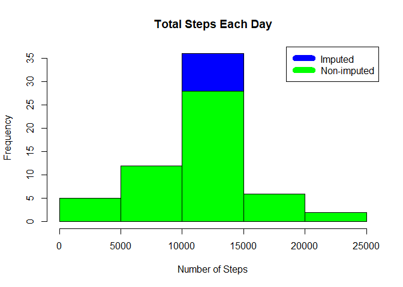

## Loading and preprocessing the data

First we load the data from the `activity.csv`. We use `dplyr` library for easier
manipulation with the data. The dates are handled with the `lubridate` library.


```r
data <- read.csv("activity.csv")  
```


## What is mean total number of steps taken per day?

First, we calculate total number of steps taken each day; we omit the incomplete cases, 
i.e., when the number of steps is not reported (missing in the data).


```r
steps_by_day <- aggregate(steps ~ date, data, sum)
```

Next, we make a histogram of the total number of steps in order to see its variance 
and distribution.


```r
hist(steps_by_day$steps, main = paste("Total Steps Each Day"), col="green",xlab="Number of Steps")
```

<!-- -->

Finally, we compute *mean* and *median* values of the total number of steps.


```r
rmean <- mean(steps_by_day$steps)
rmedian <- median(steps_by_day$steps)
```

## What is the average daily activity pattern?

Calculate average steps for each interval for all days
Plot the Average Number Steps per Day by Interval
Find interval with most average steps


```r
steps_by_interval <- aggregate(steps ~ interval, data, mean)
plot(steps_by_interval$interval,steps_by_interval$steps, type="l", xlab="Interval", ylab="Number of Steps",main="Average Number of Steps per Day by Interval")
```

<!-- -->

The 5-minute interval with maximum number of steps is as follows:


```r
max_interval <- steps_by_interval[which.max(steps_by_interval$steps),1]
max_interval
```

```
## [1] 835
```

## Imputing missing values

1.Calculate and report the total number of missing values in the dataset


```r
NATotal <- sum(!complete.cases(data))
NATotal
```

```
## [1] 2304
```

2.Using Mean for the day compute missing values


```r
StepsAverage <- aggregate(steps ~ interval, data = data, FUN = mean)
fillNA <- numeric()
for (i in 1:nrow(data)) {
    obs <- data[i, ]
    if (is.na(obs$steps)) {
        steps <- subset(StepsAverage, interval == obs$interval)$steps
    } else {
        steps <- obs$steps
    }
    fillNA <- c(fillNA, steps)
}       
```

3. Make a histogram of the total number of steps taken each day and Calculate and report the mean and median total number of steps taken per day.


```r
new_activity <- data
new_activity$steps <- fillNA
StepsTotalUnion <- aggregate(steps ~ date, data = new_activity, sum, na.rm = TRUE)
hist(StepsTotalUnion$steps, main = paste("Total Steps Each Day"), col="blue", xlab="Number of Steps")
#Create Histogram to show difference. 
hist(steps_by_day$steps, main = paste("Total Steps Each Day"), col="green", xlab="Number of Steps", add=T)
legend("topright", c("Imputed", "Non-imputed"), col=c("blue", "green"), lwd=10)
```

<!-- -->

For the sake of comparison, we also compute new *mean* and *median* values 
of the total number of steps.


```r
rmeantotal <- mean(StepsTotalUnion$steps)
rmediantotal <- median(StepsTotalUnion$steps)
rmeantotal
```

```
## [1] 10766.19
```

```r
rmediantotal
```

```
## [1] 10766.19
```

We can see that the chosen strategy has no effect on the mean; 
the median is a bit higher and now equal to the mean.

## Are there differences in activity patterns between weekdays and weekends?
Created a plot to compare and contrast number of steps between the week and weekend. There is a higher peak earlier on weekdays, and more overall activity on weekends.


```r
weekdays <- c("Monday", "Tuesday", "Wednesday", "Thursday", 
              "Friday")
new_activity$dow = as.factor(ifelse(is.element(weekdays(as.Date(new_activity$date)),weekdays), "Weekday", "Weekend"))
StepsTotalUnion <- aggregate(steps ~ interval + dow, new_activity, mean)
library(lattice)
xyplot(StepsTotalUnion$steps ~ StepsTotalUnion$interval|StepsTotalUnion$dow, main="Average Steps per Day by Interval",xlab="Interval", ylab="Steps",layout=c(1,2), type="l")
```

<!-- -->

